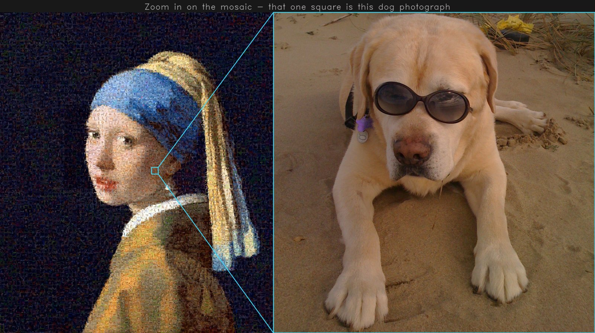
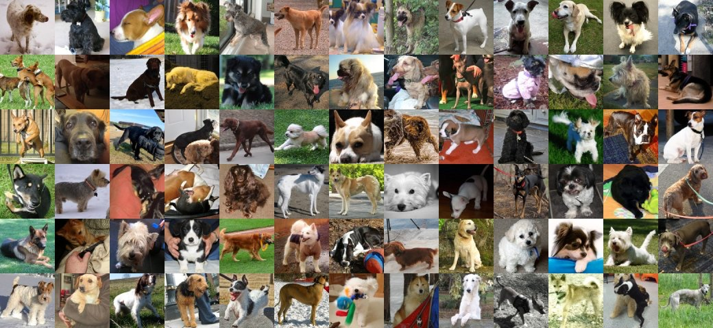

<h1 align="center">sakuhart</h1>

<p align="center"><b>Turn a video into mosaic art.</b></p>

<p align="center">
<a href="https://colab.research.google.com/github/hinanohart/sakuhart/blob/main/docs/demo.ipynb"></a>
<a href="https://pypi.org/project/sakuhart/"></a>
<a href="LICENSE"></a>
</p>

<h3 align="center">576 tiles each.</h3>

<p align="center">
  
</p>

<p align="center">
  
</p>

---

## Install

```bash
pip install sakuhart          # or: pipx install sakuhart
```

Python 3.10+. Video also needs ffmpeg; still images do not.

## Photos to build from

Point `-t` at any folder of photos. Ready-made packs are on the [Releases](../../releases) page.

<p align="center"></p>

| pack | photos |
|---|---|
| `dog` | 4,254 |
| `cat` | 2,969 |
| `flower` | 2,877 |

## Use it

1,000 photographs ship with the package, so the first run needs no downloads:

```bash
sakuhart --demo                             # the bundled painting
sakuhart portrait.jpg --demo                # your picture, from the bundled photos
```

With your own photos:

```bash
sakuhart clip.mp4 -t ./dog                  # a video
sakuhart portrait.jpg -t ./dog              # a still image
sakuhart clip.mp4 -t ./dog ./cat -o out.mp4
```

* **Close-ups work best** — anything smaller than a tile disappears, so one face beats a landscape
* Folders are searched recursively; without `-o` the result lands next to the input

| option | |
|---|---|
| `-t DIR...` | folders of photos (required) |
| `-o FILE` | where to write |
| `--cells N` | how many tiles, default `700`; at height 1080 a 16:9 frame stops at 5,184 |
| `--height N` | output height, default `1080` |
| `--diagnose` | what your photo folder is missing |
| `--demo` | rebuild the bundled painting |
| `--version` | print the version |

In: images, and `.mp4 .mov .mkv .avi .webm .m4v`. Out: `.png` or H.264 `.mp4`, audio kept.

## Speed

**CPU only — there is no GPU code.** Measured on a Ryzen 7 7735HS (8 cores), 1080p, 700 cells:

| | 1,000 photos | 10,100 photos |
|---|---|---|
| a still | **4.5 s** | **19.5 s** |
| the same still again | **2.5 s** | **5.8 s** |
| 8 s of video | **56 s** | **120 s** |
| 1 minute of video | ~7 min | ~15 min |

The second run is faster because your photo folder is cached in `~/.cache/sakuhart`. The same
input always produces the same bytes.

## How it works

1. **Describe.** Each cell gets 191 numbers — colour, histograms, edge directions, texture — plus
   its average colour in [Oklab](https://bottosson.github.io/posts/oklab/), a colour space where
   equal distances look equally different.
2. **Assign.** Every cell and every photo are matched **one-to-one, all at once**, not each cell
   grabbing its nearest photo — which is what stops your five bluest photos covering the whole sky.
3. **Re-pick by shape.** Among the close candidates, the photo whose light and dark line up with the
   cell wins. Touching cells are pulled apart so the same photograph does not sit beside itself.
4. **Recolour.** Each photo is moved toward its cell's colour, and a little of the original picture
   is blended through — more where the eye goes, more in the dark.
5. **Hold still.** For video, a frame keeps the previous frame's photos and changes only the cells
   that moved. Rebuilt from scratch, sensor noise alone reshuffles a fifth of the tiles every frame,
   and the eye reads that as boiling.

The long version is in **[HOW_IT_WORKS.md](HOW_IT_WORKS.md)**.

## Built on

* **[Oklab](https://bottosson.github.io/posts/oklab/)** — colour space where equal distances look
  equally different, so "closest colour" means what the eye means
* **The assignment problem** — the one-to-one matching, solved on a thinned graph
* **SSIM and cross-correlation** — judge shape, not just colour
* **Optimal transport in Lab** — moves a photo's colour without flattening it into a swatch
* **Local binary patterns, gradient histograms** — the texture and edge half of the 191 numbers
* **Haar cascade face detection** — finds faces, so the best photographs are spent there
* **NumPy, SciPy, OpenCV** — the libraries the arithmetic runs on
* **ffmpeg** — decoding, H.264 encoding, scene-cut detection

<details>
<summary><b>References</b> — the papers behind those, as BibTeX</summary>

```bibtex
% the form itself
@book{silvers1997photomosaics,
    title     = {Photomosaics},
    author    = {Robert Silvers},
    year      = {1997},
    publisher = {Henry Holt and Company},
}
@misc{silvers2000patent,
    title  = {Digital composition of a mosaic image},
    author = {Robert S. Silvers},
    year   = {2000},
    note   = {US Patent 6,137,498; filed 1997, granted 24 Oct 2000},
    url    = {https://patents.google.com/patent/US6137498A/en},
}

% the colour space
@misc{ottosson2020oklab,
    title  = {A perceptual color space for image processing},
    author = {Bj\"orn Ottosson},
    year   = {2020},
    url    = {https://bottosson.github.io/posts/oklab/},
}

% the texture half of the cell descriptor
@article{ojala2002lbp,
    title   = {Multiresolution Gray-Scale and Rotation Invariant Texture Classification with Local Binary Patterns},
    author  = {Timo Ojala and Matti Pietik\"ainen and Topi M\"aenp\"a\"a},
    journal = {IEEE Transactions on Pattern Analysis and Machine Intelligence},
    volume  = {24},
    number  = {7},
    pages   = {971--987},
    year    = {2002},
    doi     = {10.1109/TPAMI.2002.1017623},
}

% face detection behind the saliency weight
@inproceedings{viola2001rapid,
    title     = {Rapid Object Detection using a Boosted Cascade of Simple Features},
    author    = {Paul Viola and Michael Jones},
    booktitle = {IEEE Conference on Computer Vision and Pattern Recognition (CVPR)},
    volume    = {1},
    pages     = {511--518},
    year      = {2001},
    doi       = {10.1109/CVPR.2001.990517},
}

% the assignment problem
@article{kuhn1955hungarian,
    title   = {The Hungarian method for the assignment problem},
    author  = {Harold W. Kuhn},
    journal = {Naval Research Logistics Quarterly},
    volume  = {2},
    number  = {1--2},
    pages   = {83--97},
    year    = {1955},
    doi     = {10.1002/nav.3800020109},
}

% how it is solved in practice
@article{jonker1987shortest,
    title   = {A shortest augmenting path algorithm for dense and sparse linear assignment problems},
    author  = {Roy Jonker and Anton Volgenant},
    journal = {Computing},
    volume  = {38},
    pages   = {325--340},
    year    = {1987},
    doi     = {10.1007/BF02278710},
}

% the structure score in the second look
@article{wang2004ssim,
    title   = {Image Quality Assessment: From Error Visibility to Structural Similarity},
    author  = {Zhou Wang and Alan C. Bovik and Hamid R. Sheikh and Eero P. Simoncelli},
    journal = {IEEE Transactions on Image Processing},
    volume  = {13},
    number  = {4},
    pages   = {600--612},
    year    = {2004},
    doi     = {10.1109/TIP.2003.819861},
}

% the colour transfer sakuhart does not use
@article{reinhard2001color,
    title   = {Color Transfer between Images},
    author  = {Erik Reinhard and Michael Ashikhmin and Bruce Gooch and Peter Shirley},
    journal = {IEEE Computer Graphics and Applications},
    volume  = {21},
    number  = {5},
    pages   = {34--41},
    year    = {2001},
    doi     = {10.1109/38.946629},
}

% the colour transfer it does use
@inproceedings{pitie2007linear,
    title     = {The linear Monge-Kantorovitch linear colour mapping for example-based colour transfer},
    author    = {Fran\c{c}ois Piti\'e and Anil Kokaram},
    booktitle = {4th European Conference on Visual Media Production (CVMP)},
    publisher = {IET},
    year      = {2007},
    doi       = {10.1049/cp:20070055},
    note      = {The word "linear" does appear twice in the published title.},
}

% the colour difference the video gates are measured in
@article{sharma2005ciede2000,
    title   = {The CIEDE2000 Color-Difference Formula: Implementation Notes, Supplementary Test Data, and Mathematical Observations},
    author  = {Gaurav Sharma and Wencheng Wu and Edul N. Dalal},
    journal = {Color Research \& Application},
    volume  = {30},
    number  = {1},
    pages   = {21--30},
    year    = {2005},
    doi     = {10.1002/col.20070},
}

% the framing of the pool diagnostic
@article{peyre2019ot,
    title   = {Computational Optimal Transport},
    author  = {Gabriel Peyr\'e and Marco Cuturi},
    journal = {Foundations and Trends in Machine Learning},
    volume  = {11},
    number  = {5--6},
    pages   = {355--607},
    year    = {2019},
    eprint  = {1803.00567},
    archivePrefix = {arXiv},
    url     = {https://arxiv.org/abs/1803.00567},
}
```

</details>

## Privacy

Everything runs on your machine.

## Credits

Thank you to the four people whose clips are rebuilt in the images above:

* dog — [Michal Petráš](https://www.pexels.com/@michal-petras-2152077115/) (Pexels)
* DNA — [doktorkleinmusic](https://pixabay.com/users/doktorkleinmusic-5871510/) (Pixabay)
* panda — [flutie8211](https://pixabay.com/users/flutie8211-17475707/) (Pixabay)
* black cat — [Alex Dos Santos](https://www.pexels.com/@alex-dos-santos-305643819/) (Pexels)

And thank you to every photographer behind the tiles — [CC BY 2.0](https://creativecommons.org/licenses/by/2.0/)
photographs from **Open Images V7** (Google), cropped square and resized to 120px:

* **[dog](docs/credits-dog.md)** — 2,041 photographers
* **[cat](docs/credits-cat.md)** — 1,543 photographers
* **[flower](docs/credits-flower.md)** — 1,555 photographers
* the 1,000 bundled with the package — 853 photographers, credited inside it as
  `sakuhart/ATTRIBUTION.md`

## Licence

MIT — see [LICENSE](LICENSE). The photographs are not covered by it: both the packs and the 1,000
bundled with sakuhart are CC BY 2.0. If you publish a mosaic built from them, ship the
`ATTRIBUTION.md` that came with them alongside it.
